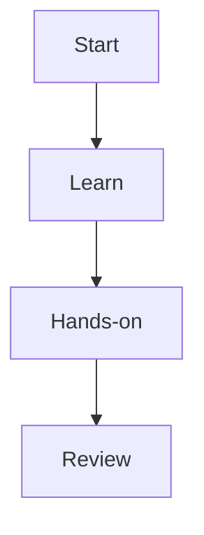

# ModuleXX タイトル

## Moduleの目的

## 到達目標

- 
- 
- 

## 前提知識

## 全体像

## Lesson一覧

1. [Lesson01](lessons/lesson01-topic.md)

## Lab

- [Lab01](labs/lab01-topic.md)

## 演習

- [Beginner](exercises/beginner.md)
- [Intermediate](exercises/intermediate.md)
- [Advanced](exercises/advanced.md)
- [Answers](exercises/answers.md)

## 最低限試すこと

## Module完了条件

- [ ] 
- [ ] 

## 次のModule
