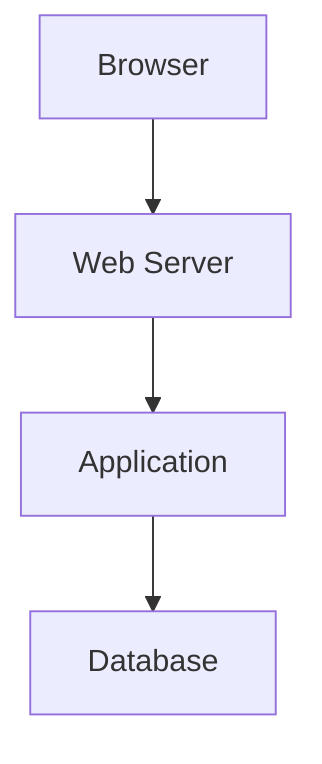

# Writing Guidelines

## 目的

このファイルは、Debug Handbookの内容品質を一定に保つための執筆ルールです。

単なるコマンド一覧ではなく、読者が実務で判断し、手を動かし、結果を説明できる教材を目指します。

---

## 1. 各Lessonで必ず答えること

各Lessonは、最低限次の問いに答えます。

1. これは何か
2. なぜ必要か
3. 実務ではいつ使うか
4. 最初に何を確認するか
5. どのコマンド・画面を使うか
6. 結果から何が分かるか
7. 次に何を確認するか
8. よくある失敗は何か
9. 自分で再現できるか
10. 修正後に何を確認するか

---

## 2. 標準Lesson構成

```markdown
# LessonXX タイトル

## ゴール

## 前提知識

## このLessonで身につくこと

## 実務ではいつ使う？

## 全体像

## 基本

## 仕組み

## 実務での調査手順

## コマンド・設定例

## 結果の読み方

## よくある失敗

## トラブルシューティング

## ハンズオン

## 演習

## 模範解答

## チェックリスト

## 関連Lesson

## 参考資料

## 学習ログ
```

内容によって不要な節は省略できますが、`ゴール`、`実務ではいつ使う？`、`ハンズオン`、`チェックリスト` は原則必須です。

---

## 3. 説明の順番

原則として、広い範囲から狭い範囲へ説明します。

```text
現象
  ↓
全体構造
  ↓
観測できる証拠
  ↓
原因候補
  ↓
検証方法
  ↓
修正
  ↓
再確認
```

いきなり細かいオプション一覧から始めないようにします。

---

## 4. コード・コマンドのルール

### コピペ可能にする

悪い例:

```text
docker logsを見る
```

良い例:

```bash
docker compose logs -f --tail=200 web-php8
```

### 実行場所を書く

必要に応じて次を明記します。

- ホスト側で実行
- Dockerコンテナ内で実行
- MySQLクライアント内で実行
- プロジェクトルートで実行

### プレースホルダーを明確にする

```bash
git show <commit>
```

`<commit>` が置換対象であることを本文で説明します。

### 危険なコマンドに警告を付ける

> **注意**
> `rm -rf`、`git reset --hard`、`docker compose down -v` などは、影響範囲を確認してから実行します。

---

## 5. 実務例のルール

実務例には、可能な限り次を含めます。

```markdown
## 現象

## 再現手順

## 期待結果

## 実際の結果

## 最初の仮説

## 確認した証拠

## 原因

## 修正

## 再確認

## 学び
```

案件名・顧客名・URL・認証情報は匿名化します。

---

## 6. ハンズオンのルール

ハンズオンは「コマンドを打った」で終わらせません。

必ず結果を記録させます。

```markdown
## 実行したこと

## 実行結果

## その結果から分かったこと

## 次に確認すること

## 実務で使える場面
```

---

## 7. 演習問題のルール

演習は次の種類を組み合わせます。

- 用語説明
- コマンド作成
- 出力の読み取り
- 調査順序の組み立て
- 誤った手順の指摘
- ケーススタディ
- 制限時間付きドリル

単なる暗記問題だけにしません。

---

## 8. 図解のルール

処理の流れ、通信、依存関係、調査順序にはMermaidを優先します。



画面操作の説明にはスクリーンショットを使います。

画像はModule内の次の場所に置きます。

```text
assets/images/
```

Mermaidの元ファイルや図解メモは次へ置きます。

```text
assets/diagrams/
```

---

## 9. 参考資料のルール

優先順位:

1. 公式ドキュメント
2. 仕様書・RFC
3. 公式GitHubリポジトリ
4. 信頼できる技術記事
5. 個人ブログ

バージョンや公開時期で内容が変わりやすい場合は、確認日を書きます。

```markdown
- [VS Code Debugging](https://code.visualstudio.com/docs/editor/debugging)
  - 確認日: 2026-07-10
```

---

## 10. AI関連のルール

AIを使った手順では、次を明記します。

- どの情報をAIへ渡してよいか
- 秘密情報を含めないこと
- 出力を検証する方法
- `git diff` やテストで確認すること
- AIの推測と実際の証拠を分けること

AIの回答だけを根拠に原因を確定しません。

---

## 11. 完成条件

Lessonを完成扱いにする前に確認します。

- [ ] ゴールが具体的
- [ ] 実務で使う場面が書かれている
- [ ] コマンドがコピペ可能
- [ ] 結果の読み方が書かれている
- [ ] よくある失敗がある
- [ ] ハンズオンがある
- [ ] チェックリストがある
- [ ] 公式資料がある
- [ ] 秘密情報が含まれていない
- [ ] 関連Lessonへの導線がある
